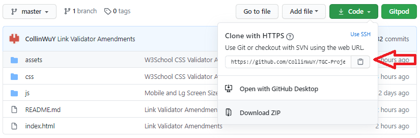

# TableTopSix MarketPlace - All your tabletop RPG needs #

### TGC - Fullstack Framework Milestone Project 4 ###
By: **Collin Wu Yuewei** -- *Code Institute Batch 8* -- 
##### Made with Python/Django ######
 

## SUMMARY ##
The intent of this webpage is to be the market place for the communal forum for enthusiast to share they review on books from their favourite tabletop rpg series. The site aims to be the market place e-commerce webpage to find all your tabletop rpg needs.
 

##### Home Page Preview ####

##### Book Product Info Preview ####

## PROJECT AIM/INTENT ##
The goal of the project is to build an e-commerce website using Python language with Django framework and Sqlite to present useful products information to be sold to users and allow other users to comment/review on the product. Products can be added to the catalogue via CRUD with permission only from a Adminstrative Account (superuser), using techonology and languages taught in the Code Institute Fullstack Web Developer Program; at Project 4, namely HTML, CSS, JS, Python, Django, Sqlite, Heroku.

__The concept chosen for this project is to create a marketplace for the communal book review website Tabletop Six for enthusiast. To become a resource or reference for others who might want to jump into the hobby, or looking for information and different products in one place__ 

The problem is that there are too many series of such tabletop rpgs, books are typically found at the main publisher's webpage that only sold their series. While at TableTopSix Marketplace, you are able to obtain used reviews and products of different genre, category, series all in a single location.
 
 

## FULL DEMO ##

The full website demo can be previewed here: [Tabletop Six MarketPlace Webpage](https://cwy-tgc8-project4.herokuapp.com/)

 

___User Accounts___
| Permission | User Login | Password |
| ---------- | ---------- | -------- |
| superuser  | admin      | admin123 |
| normal     | test@email.com | tester123 |

  

___Stripe testing Credit Card Info___
| Card No | Card Name | Card Expiry Date | Card CVV |
| ------- | --------- | --------- | -------- |
| 4242 4242 4242 4242 | Test | 11/22 | 222 |

 
Or create your own account with a valid email as there will be a verification email sent to you to verify the account.

 

## User Stories ##

| Permission Level | Event/Usage of Site | Navigation | Outcome |
| ---------------- | ------------------- | ---------- | ------- |
| Non-sign-up | Looking for information | Can view site, books, information and revies on them | Gets more informed and may sign up to purchase |
| Exisiting user | Want to buy the latest book | Search for book via search bar with the category | Get books related to category and finds book with filter, purchases product |
| Non-sign-up | New to hobby, looking for horror genre type rpgs | Search for books use "Horror" tag | Get display of books with Horror genre and chooses the series with information and reviews |
| Adminstator | Adding new book | Uses the quick access button on the top to create book | Fills in the create book form and uploads all images, submits to back end | New product is immediately displayed |
| Existing user | Leaving reviews and get offended by other reviews | Cannot delete reviews not owner of, have to contact adminstator via email | Review in view is investigated and removed if necessary |

## WireFrames ##
The main wireframes made with [Wireframe CC](https://wireframe.cc/) are planned originally for the most crucial parts of the webpage, mainly the home page and book info, as development goes, more features are added/modified: 
 

Wireframe planning for Homepage:
 
 

Wireframe planning for Show All Books:
 
 

Wireframe planning for Book Info Page:
 
 

__MOBILE__

Wireframe planning for Homepage (Mobile):

Wireframe planning for Book Info Page (Mobile):
 
 

## Database Planning ##

As the database used for the project is Sqlite, database relationships are necessary as compared to MongoDB.

Database Planning Diagram:

Things to Consider: 
- Session Id is taken care by Allauth package, giving session id, user id and authentication
- Cart app functions on a session by session basis, and the payment is outsourced directly to Stripe with specific variables

 

## UX DESIGN ##

- Firstly the design is fully mobile responsive, navbar to collpased logo icon that has the navbar and book cards wrap to make 3 -> 2 -> 1 card per screen depending on size. 

- The layout is mainly designed for desktop users or large tablet users. There is a persistent sticky cart button with total value in cart(quick access and jumps to cart page) updates the user on the amount that is currently being purchased.
     
- The navbar has dropdown list for the most current release books as well as the link to show all books. 
     
- The search bar allows search of partial information on book titles, categories and genre for both on the navbar and the main page.
     
- Quick access buttons at the top of the page become available if the account is superuser permission level, which show buttons to create new book products and admin page for backend. 
     
- All book cards have a pop-up to give general information on the book, a "more info" button that redirects the user to the book info page.
     
- A large call to action button to add item to cart (requires login), with the cart nav button on the top right of the page showing the total cost currently in cart.
     
- The book info page has buttons to edit/delete book buttons only available to adminstrator superuser level.
     
- Reviews on each book can only be posted if user is logged in, and the comments can only be deleted by the original poster or adminstator.
     
- Signing up a new account is available both at the quick access button above "Join Now" as well as "sign up" link in the login page, which will sent an email to the registered email for verification.
     
- Password resets are also available at the login page
     
- The cart page shows a breakdown of all items in the cart, as well as "add" and "minus" buttons to increase the quantity quickly. There is also a trash can button to quickly remove the item from the cart.
     
- All actions, from adding items to carts, add/subtracting quantity, book product creation and removal, reviews creations and removal, login/logout, warnings and prompts have a Toastr message pop-up to inform the user that the action is completed.
     
- All payment is outsourced directly to Stripe, therefore no private information is maintained by this webpage
     

## Features ##
- Robust backend database, only accessible by adminstator superuser permissions.
- Full User system that governs, sign up, login, logout, reset password, sending validation emails, which can be further modified at backend admin page with adminstator superuser permission.
- Allow any user to browse the webpage, but only customers with accounts to purchase product and leave comments.
- Quick fast keyword search functions for titles/genres/categories
- Filtering system to filter books on the show all books catalogue page based on series or tags
- Persistant cart nav icon for quick access to checkout and showing their current total at all times
- Quick access buttons are only available to users logged in with the correct permission level.
- Online payment via Stripe for quick online checkout
 

### Features Left to Implement ###

- WIP: Categories such as Assets and Minatures to be added to the product line to encompass more holistic one stop market place
- User history and profile page for reference adn data tracking
- Product purchase value, to track what is trending and is not selling
- Product recommendation when a user buy a certain production as well as bundles
- Ability to allow PAID users to post their own products
 

## Technologies Used ##

__Front-End__
* [HTML](https://www.w3schools.com/html/ "HTML Info Page")
    - HTML is universal base language for creating webpages compatible with majority browsers

* [CSS](https://www.w3schools.com/css/ "CSS Info Page")
    - CSS is used for implementing styling to a webpage 

* [JavaScript](https://www.w3schools.com/js/ "JavaScript ES6 Info Page")
    - JavaScript is the programming language of HTML and the Web
    - Used for API data retrieval
    - Button interactions
    - Color background changes
    - Sort gathered information and creation of JSON for data collected for unified access
* [jQuery](https://jquery.com/ "jQuery Homepage")
    - Most commonly used JavaScript Library
    - Ajax API calling
    - Makes coding way easier than base JavaScript 
* [Wireframe CC](https://wireframe.cc/ "Wireframe Tool for Planning")
    - Used to design webpages wireframes quickly
    - Free to use

__Back-End__
* [Python](https://www.python.org/ "Python Homepage")
    - Primary Coding Lanuage for logic handling and interaction with MongoDB database
    - An interpreted, object-oriented, high-level programming language with dynamic semantics
* [Django Framework](https://www.djangoproject.com/ "Django Homepage")
    - Framework in conjunction with Jinja2 templating language for Python
    - Free and Open Source
    - Lightweight WSGI web application framework capable of scaling up
    - Able to have template inheritence
* [Jinja 2](https://jinja.palletsprojects.com/en/2.11.x/ "Jinja2 Homepage")
    - Jinja is a modern and designer-friendly templating language for Python
    - Modelled after Django’s templates
    - Fast, widely used and secure with the optional sandboxed template execution environment
* [Sqlite](https://www.sqlite.org/index.html "Sqlite Homepage")
    - Lightweight relationship based Database
    - Integrated with Django for quick use, no install required
* [Stripe](https://stripe.com/en-sg "Stripe Homepage")
    - Quick fast online payment API
    - Handles all purchase orders and deals directly with the user for private information
    - Incorporates various payment methods such as amazon pay, grab pay, google pay
* [Git](https://git-scm.com/ "Installation for Git Support")/[Github](https://github.com/ "Github Homepage")
    - For version control and commits to Github
* [Gitpod IDE](https://www.gitpod.io/ "Gitpod IDE Homepage")
    - Online open-source IDE from GitHub
    - Cloud narrative Development
    - Quick code reviews by sharing Links
    - Minimal IDE setup

__Deployment__
* [Heroku](https://www.heroku.com/ "Heroku Cloud Application Platform")
    - Quick free deployment of webpages
    - Whole dashboard system support
    - Connects with Github commits
    - Can be upgraded for Commerical Use/Customer Facing 
 

## Testing ##

#### Responsiveness ####
The webpage was manual tested for responsiveness on physical iPhone 6S, Samsung S8+, Xiaomi Mi Max2, 1920 x 1080 laptop screen.

As Django has a strong security feature such as FrameX, online display tools such as [Responsiveness Tool](http://responsivetesttool.com/ "Responsiveness Tool Homepage")  and  [Mobile-Friendly Test](https://search.google.com/test/mobile-friendly?id=07L3WeU_nndVYwaUTleP7w "Mobile Friendly Test Homepage")  or [Am I Responsive Design](http://ami.responsivedesign.is/ "Am I Responsive Design Homepage"), cannot be used to show such repsonsiveness. Instead Google inspector with various screen width is used instead.

Responsive is tested using Google Inspector   

All platforms had to have correct CSS design, working animation, buttons, pop-up and elements placed in the correct position.

#### Page Load Time ####

The page load time is tested using [Pingdom Tool](https://tools.pingdom.com/ "Pingdom Homepage") while being hosted on Heroku Platform. This is vital and important as the goal was to have a responsive, non-laggy webpage with no link-loading from page to page, achieving an __C__ rating of __76/100__ points also on Asia, America and European Servers. The major slow down is due to the off-site queries to the images hosting webpage Cloudinary for each review book. With more code optimization and an image database, I believe better page load time can be achieved.

#### Code Validation ####

Code validation is achieve by using developer tools provided by [W3C Developer Tools](https://w3c.github.io/developers/tools/ "W3C Developer Tools Webpage"). The webpage code tested til no errors are found on their checkers. 

 - __CSS errors are from bootstrap and toastr packages.__ 
 - __Link errors are all tested and confirmed working, from Google Fonts, Facebook, Twitter.__ 

, , , .

#### Manual Testing ####

Other testing include:
- Testing creation of user accounts, email verification, reset Password
- Logged In User permission, access buttons only avaible when the correct user is logged in
- Editing/Deleting reviews can only be done by Original Poster
- Cart item quantity add/minus/remove logic working
- Adminstrative Account access and permission to edit/delete/create any review
- All pages redirect/ render correct pages
- Searching jQuery Ajax Calls to Django/Sqlite all working and updating front-end properly
- Mobile friendly resize of all html pages
- Stripe payment and checkout payment complete working
- All Toastr messages popup with color code

#### Browser Testing ####

The site while being hosted by Heroku Cloud Application Platform is tested on a laptop of 1920x1080 resolution:
- Brave
- Google Chrome
- Firefox
- Microsoft Edge

#### Bugs ####

- On certain browsers, like Safari, Opera, any non-google friendly browsers will cause JavaScript to not function on old versions of Safari and Firefox Browsers. Some minority browser might cause CSS to not display as intended. However based on [W3School Browser Statics](https://www.w3schools.com/browsers/) in 2020, 80%+ uses Chrome, small number of people uses other browsers.

- During Updating/Edit Book page, the cloudinary fields do not pull from the cloudinary server, resulting in the user to upload the images again, even if there is no change.

## Deployment ##

This project uses Git for version control and hosts the repository for all commits. The depolyed site is hosted by [Heroku -Deployed Site](https://cwy-tgc8-project-3.herokuapp.com/ "Deployed Site")  where it can automatically updated on new commits directly to Heroku Master instead of GitHub.

This project can be accessed via [CollinWuY's Github](https://github.com/CollinWuY/TGC-Django-Proj4 "Project's Repository") where you can clone/download to your computer directly, or immedaitely view the code via Gitpod. 

All the needed assets, images, fonts, icons, javascript, css are in their respective folders, the main application to run is app.py.

#### Commiting to GitHub ####

Code is commited to GitHub regularly for version control:
- First by creating a Git Repository on GitHub (we are using Code-Institute's Template)
    - Link the IDE to the Git Repository, in this instance opening Gitpod directly from the Github or by type the command `git remote add origin <repository url>`
    - Whenever changes to code is saved, you can stage the changed files with `git add .` for by using the Source Control UI of Gitpod and pressing the plus sign below the text box to add stages
    - Staged content is then commited with a clear defined message with `git commit -m "<msg>"` or by typing in the Source Control UI Tab of Gitpod and pressing the Tick above it
    - The commits are then pushed to the origin GitHub linked to the IDE via `git push -u origin master` or push option in the Source Control UI tab of Gitpod

Deployment to Heroku is performed using command lines (Setup steps taken from Paul KunXin, lecturer of Trent Global):
- First Install Heroku on your local machine with `sudo snap install heroku --classic`, skip this step if it is already installed
    - Install all dependencies with `sudo apt install libpg-dev python3-dev`
    - Install all relevant packages with `pip3 install gunicorn` `pip3 install psycopg2` `pip3 install Pillow` `pip3 install whitenoise` `pip3 install dj_database_url`
    - Add whitenoise to the Middleware in the `settings.py` of the main app `whitenoise.middleware.WhiteNoiseMiddleWare`
    - Enable whitenoise to work by adding `STATIC_ROOT=os.path.join(BASE_DIR, 'staticfiles')` into the `settings.py`
    - Log in into Heroku using `heroku login -i`
    - Create a new app on Herkou `heroku create <app-name>` , as app name needs to be unique throughout the web, it is suggested to put your initials before the app name
    - Verify the remotes that have been added with `git remote -v`, both your github and heroku
    - Copy your environment variables from .env file to heroku app dashboard config var settings
    - Create a `Procfile` (no extenstion) and add in to file the FIRST LINE ONLY `web: gunicorn <your main app name>.wsgi:application`
    - Change the `ALLOWED_HOSTS` in the `settings.py` to allow the domain name from heroku, `https://<heroku link>.herokuapp.com`
    - Freeze your imports and dependencies with `pip3 freeze --local > requirement.txt`
    - Finally commit your changes and push to Heroku using `git add.` `git commit -m "<msg>"` then `git push heroku master`
    - Setup the new postgres database on heroku, type `heroku config` into terminal and copy the DATABASE_URL value and add it into the .env file `export DATABASE_URL="<database_url>"`
    - Export all your sqlite databse information use `python3 manage.py dumpdata --natural-primary --natural-foreign > dump.json`
    - Change the database settings first `import dj_database_url` then in `settings.py` comment out the old DATABASES setting(keep if you need to access old sqlite database) then add in `DATABASES = {'default, dj_database_url.parse(os.environ["DATABASE_URL"])}`
    - Migrate to new postgres database with `python3 manage.py migrate`
    - Load all data from dump.json into database with `python3 manage.py loaddata dump.json`
    - Finally commit your database changes and push to Heroku using `git add.` `git commit -m "Updated settings.py"` then `git push heroku master`

#### Setting Up Env For Heroku ####

Head to the [Heroku](https://www.heroku.com/ "Heroku Cloud Application Platform") webpage and login to your dash board
- Choose the correct application you made previously
    - Under the Settings Tab --> Config Vars (Reveal Config Vars)
    - Add in your Var keys from the .env to the dashboard, ___Extreme Caution___: avoid any trailing whitespaces in the values.

#### Downloading Locally ####

_Kindly Ensure Your Local IDE has all the required plugin/extensions for Python/Flask/Jinja_

All files can be easily download on the Github site:
1.  At the top right, click on green button under __CODE__
2.  Select last option: Download .zip

3.  Download the .zip file that can be opened with a ZIP unpacker or RAR unpacker 
4.  Unzip the package
5.  Double click the index.html
    -   it should open on your preferred browser.

#### Linking to Local IDE ####

Cloning this repository can be achieve by using the link provided at the Github site:
1. At the top right, click on green button under __CODE__
2. Copy the link provided: `https://github.com/CollinWuY/TGC-Django-Proj4`

3. In your preferred IDE, Run in terminal `git clone https://github.com/CollinWuY/TGC-Django-Proj4.git`
4. Repository will be cloned as a folder on your computer 
 

## Credits ##

#### Media ####

__DISCLAIMER__ 
All media images rights belong to the respective companies that own the art. This webpage only displays them for identification and not used for monetary purpose.

- Book Review Images Art are taken from the respective Companies Webpages
- Banner Image is taken via Online Search
- Body Black Wooden Wallpaper is taken from [WallpaperCave](https://wallpapercave.com/w/wp3157716)

#### Icons ####

- All icons are downloaded/linked as SVG from [Font Awesome](https://fontawesome.com/)
- Browser Tab Icon is Logo convertered using [Favicon.io](https://favicon.io/favicon-converter/)

#### Code/Concept ####

- Most setup code concept is from Paul KunXin, lecturer from Trent Global, especially settings and delopyment to heroku. 

#### Fonts ####

- Fonts are taken from Google Fonts; [Google Fonts Medieval Sharp](https://fonts.google.com/specimen/MedievalSharp) and [Google Fonts El Messiri](https://fonts.google.com/specimen/El+Messiri)
 
 

__THIS WEBSITE IS FOR EDUCATIONAL PURPOSE ONLY - ALL RIGHTS RETAIN BY COLLIN WU YUEWEI__
